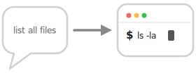

<div align="center">

# zxcv

##### Fly on your terminal, without the stress of memorizing commands.

[](https://rust-lang.org/)
[](https://github.com/junegunn/fzf)



</div>

`zxcv` is a CLI tool that turns a natural-language description into one-liner
shell commands using an LLM. It opens an `fzf` picker pre-loaded with your
selection history and lets you pull fresh candidates from the LLM on demand.
Selecting a candidate inserts it into your shell's command-line buffer (via a
shell-integration widget) so you can review or edit it before pressing Enter.

<u>**TOC**</u>
- [Features](#features)
- [Requirements](#requirements)
- [Installation](#installation)
  - [Homebrew (macOS / Linuxbrew)](#homebrew-macos--linuxbrew)
  - [From crates.io](#from-cratesio)
  - [Prebuilt binary (shell installer)](#prebuilt-binary-shell-installer)
  - [From source](#from-source)
  - [Build without installing](#build-without-installing)
  - [Man pages](#man-pages)
- [Uninstallation](#uninstallation)
  - [Homebrew](#homebrew)
- [Configuration](#configuration)
  - [Example config](#example-config)
  - [Setting precedence](#setting-precedence)
  - [Environment variables](#environment-variables)
- [Usage](#usage)
  - [Direct invocation](#direct-invocation)
  - [Shell integration](#shell-integration)
    - [zsh](#zsh)
    - [bash](#bash)
  - [First-run hint](#first-run-hint)
  - [Safety prompt](#safety-prompt)
- [Subcommands](#subcommands)
- [File locations](#file-locations)
- [Default models](#default-models)
- [Development](#development)
  - [Debugging](#debugging)
- [License](#license)


## Features

- Natural-language to shell one-liner generation
- Multiple LLM providers: Anthropic, OpenAI, Ollama, Gemini
- `fzf`-based interactive picker with structured-output candidates
- Selection history with zoxide-style frecency scoring
- LLM response cache (no repeated calls for the same query)
- Shell integration for zsh and bash — selected commands land in the prompt
  buffer, not auto-executed
- Safety check that warns on destructive commands (`rm -rf /`, `dd of=/dev/...`,
  fork bomb, etc.) with a y/N confirmation
- User-defined extra danger patterns via config

## Requirements

- Rust toolchain (1.86+ recommended; edition 2024)
- [`fzf`](https://github.com/junegunn/fzf) on your `PATH` (the Homebrew install
  pulls it in automatically; other install methods need a manual `brew install
  fzf` / `apt install fzf` etc.)
- macOS or Linux
- An API key for one of: Anthropic / OpenAI / Gemini (Ollama needs only a
  running local server)

## Installation

### Homebrew (macOS / Linuxbrew)

```sh
brew install kuzukawa/tap/zxcv
```

### From crates.io

```sh
cargo install zxcv
```

The binary is placed in `~/.cargo/bin`; make sure that directory is on your
`PATH`.

### Prebuilt binary (shell installer)

For macOS / Linux without a Rust toolchain. Installs into `~/.local/bin` by
default:

```sh
curl --proto '=https' --tlsv1.2 -LsSf \
  https://github.com/kuzukawa/zxcv/releases/latest/download/zxcv-installer.sh | sh
```

Tarballs for each target are also attached to every GitHub Release:
<https://github.com/kuzukawa/zxcv/releases>.

### From source

```sh
git clone https://github.com/kuzukawa/zxcv.git
cd zxcv
cargo install --path .
```

### Build without installing

```sh
cargo build --release
# binary at ./target/release/zxcv
```

### Man pages

After installing `zxcv` (any method), run once:

```sh
zxcv install-man
```

This generates and writes man pages under `$XDG_DATA_HOME/man/man1/` (defaults
to `~/.local/share/man/man1/`). After that, `man zxcv`, `man zxcv-config`,
`man zxcv-history`, etc. work.

If `~/.local/share/man` is not in your manpath, `install-man` prints the
`export MANPATH=...` line you need to add to your shell rc.

For a system-wide install (visible to all users):

```sh
sudo zxcv install-man --prefix /usr/local
# Pages go to /usr/local/man/man1/
sudo mandb 2>/dev/null || true   # refresh index on Linux
```

Developers can also generate man pages without installing them:

```sh
cargo run --example gen-man         # writes target/man/*.1
man -l target/man/zxcv.1
```

## Uninstallation

### Homebrew

```sh
brew uninstall zxcv
```

`brew uninstall` removes only the binary. To also remove user data:

```sh
rm -rf ~/.config/zxcv                   # config
rm -rf ~/.local/state/zxcv              # history + first-run sentinel
rm -rf ~/.cache/zxcv                    # LLM response cache
rm -f  ~/.local/share/man/man1/zxcv*.1  # man pages (if installed)
```

> If you customized `XDG_CONFIG_HOME`, `XDG_STATE_HOME`, `XDG_CACHE_HOME`, or
> `XDG_DATA_HOME`, substitute those paths above.

## Configuration

`zxcv` reads optional settings from `~/.config/zxcv/config.toml`. Run

```sh
zxcv config
```

to create the file from a template and open it in `$VISUAL` / `$EDITOR`.

### Example config

```toml
provider = "anthropic"   # anthropic | openai | ollama | gemini

[providers.anthropic]
model = "claude-sonnet-4-6"
# api_key = "sk-ant-..."   # prefer ANTHROPIC_API_KEY env var

[providers.openai]
model = "gpt-5"
# api_key = "sk-..."       # or OPENAI_API_KEY env var

[providers.ollama]
endpoint = "http://localhost:11434"
model = "llama3"

[providers.gemini]
model = "gemini-2.5-flash"
# api_key = "..."          # or GEMINI_API_KEY env var

[safety]
extra_patterns = ["^my-dangerous-cmd"]
```

### Setting precedence

For each value the highest available source wins:

```
CLI flag > environment variable > config file > built-in default
```

### Environment variables

| Variable             | Purpose                                       |
|----------------------|-----------------------------------------------|
| `ZXCV_PROVIDER`      | Override the provider name                    |
| `ZXCV_MODEL`         | Override the model name                       |
| `ANTHROPIC_API_KEY`  | API key for Anthropic                         |
| `OPENAI_API_KEY`     | API key for OpenAI                            |
| `GEMINI_API_KEY`     | API key for Gemini                            |
| `ZXCV_DEBUG`         | When set, write debug log to a file           |
| `ZXCV_DEBUG_LOG`     | Debug log path (default: `/tmp/zxcv-debug.log`) |

Ollama needs no API key; configure `endpoint` instead.

## Usage

### Direct invocation

```sh
# Open the fzf picker with an initial query
zxcv "find files modified in the last 24h"

# Open the picker with no initial query (just your history)
zxcv

# Switch provider/model for one call
zxcv --provider openai --model gpt-4o "compress this directory"
```

In the fzf picker:

| Key      | Action                                                   |
|----------|----------------------------------------------------------|
| Type     | Filter your selection history                            |
| `Ctrl-G` | Call the LLM and reload candidates                       |
| Enter    | Choose the highlighted candidate                         |
| Esc      | Cancel                                                   |

When `Ctrl-G` triggers an LLM call, results are cached on disk keyed by
provider + model + query, so the next `Ctrl-G` with the same query is
instantaneous.

### Shell integration

The picker by itself only prints the selected command to stdout. To have it
land **in your shell's command-line buffer** (not executed — you still press
Enter yourself), install the shell widget:

#### zsh

Add to `~/.zshrc`:

```sh
eval "$(zxcv init zsh)"
bindkey '^[z' zxcv-widget   # Alt+Z — pick any key you like
```

Reload your shell, then press your chosen key. Anything already on your prompt
is forwarded to `zxcv` as the initial query; on selection it replaces the
buffer with the chosen command.

> Tip: avoid `Ctrl-G` for the widget binding — that key is reserved for the
> LLM-reload action *inside* the fzf picker.

#### bash

Add to `~/.bashrc`:

```sh
eval "$(zxcv init bash)"
bind -x '"\C-x\C-g": zxcv-widget'   # Ctrl-X Ctrl-G — pick any key you like
```

### First-run hint

The first time `zxcv` is launched **outside** the shell widget, it prints a
short setup hint to stderr and waits for Enter before opening the fzf picker.
This is shown once per machine; a sentinel file at
`~/.local/state/zxcv/hint-shown` is created to suppress subsequent prints.

If you launch `zxcv` via the widget (any binding installed from `zxcv init`),
the hint is **never** shown — the widget sets `ZXCV_FROM_WIDGET=1` so `zxcv`
knows the setup is already done. Delete the sentinel file to see the hint
again.

### Safety prompt

When the selected command matches a built-in or user-defined destructive
pattern, `zxcv` writes a warning to stderr and prompts for confirmation:

```
[zxcv] Warning: potentially destructive command detected:
       rm -rf ~
       matched pattern: (?:^|[;&|])\s*rm\s+(?:-[a-zA-Z]*r[a-zA-Z]*f[a-zA-Z]*|...
       Use anyway? [y/N]
```

Built-in patterns cover `rm -rf` against root / `~` / `$HOME` / `*`, raw
writes to disk devices (`dd of=/dev/sda`), `mkfs.*`, power commands
(`shutdown`, `reboot`, `halt`, `poweroff`, `init 0`), fork bombs,
`chmod -R 777`, recursive `chown` of `/`, and writes to sensitive `/etc`
files. They are intentionally conservative — `rm -rf ./build` and
`rm -rf /tmp/foo` do **not** trigger. Add your own regex patterns in
`config.toml` under `[safety] extra_patterns = [...]`.

## Subcommands

| Command                | Description                                                       |
|------------------------|-------------------------------------------------------------------|
| `zxcv [QUERY]`         | Open the fzf picker (default action)                              |
| `zxcv init <SHELL>`    | Print shell integration script (`zsh` or `bash`)                  |
| `zxcv config`          | Open `~/.config/zxcv/config.toml` in `$EDITOR`                    |
| `zxcv history`         | List history entries (frecency-sorted)                            |
| `zxcv history clear`   | Delete all history                                                |
| `zxcv install-man`     | Install man pages under `$XDG_DATA_HOME/man/man1/`                |

## File locations

| File                              | Purpose                                       |
|-----------------------------------|-----------------------------------------------|
| `~/.config/zxcv/config.toml`      | Configuration                                 |
| `~/.local/state/zxcv/history.toml`| Selection history                             |
| `~/.local/state/zxcv/hint-shown`  | Sentinel that suppresses the first-run hint   |
| `~/.cache/zxcv/llm_cache/`        | Cached LLM responses                          |

`XDG_CONFIG_HOME`, `XDG_STATE_HOME`, and `XDG_CACHE_HOME` are respected.

## Default models

| Provider  | Default model         |
|-----------|-----------------------|
| Anthropic | `claude-sonnet-4-6`   |
| OpenAI    | `gpt-5`               |
| Gemini    | `gemini-2.5-flash`    |
| Ollama    | `llama3`              |

Override with `--model <name>` or `ZXCV_MODEL`.

## Development

```sh
cargo build              # debug
cargo build --release    # optimized
cargo test               # unit tests (safety module)
cargo clippy --all-targets -- -D warnings
```

### Debugging

Set `ZXCV_DEBUG=1` to write a verbose log to `/tmp/zxcv-debug.log` (override
the path with `ZXCV_DEBUG_LOG`). Useful for inspecting LLM calls and fzf
plumbing.

```sh
ZXCV_DEBUG=1 zxcv "your query"
tail -f /tmp/zxcv-debug.log
```

## License

MIT — see [LICENSE](LICENSE).
